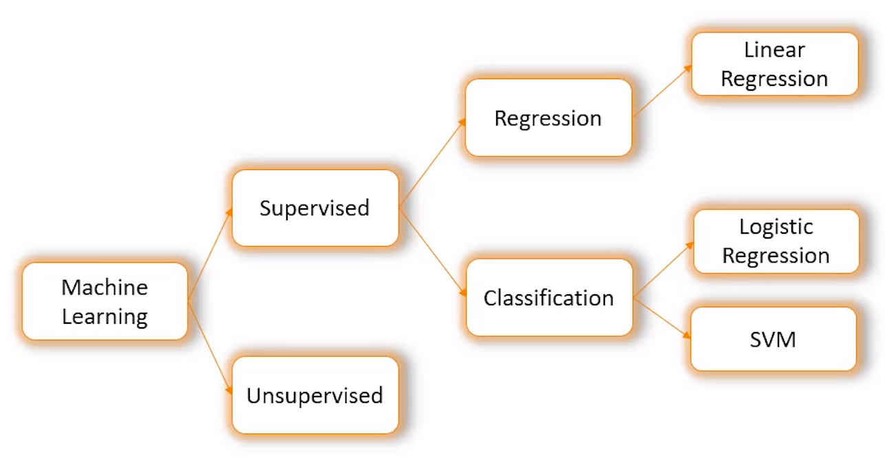

## [Machine Learning](https://intellipaat.com/academy/course/machine-learning-free-course/) 

### Types of Machine Learning
    1. Supervised Learning
    2. Unsupervised Learning
    3. Reinforcement Learning

#### What can you do with Machine Learning?
What type of question can you ask machine with:

- Classification Algorithm  -    Category is predicted using the data
- Anomaly Dection Algorithm -   Identify unusual data points
- Clustering Algorithm      -   Groups data based on some condition
- Regression Algorithm      -    Groups data based on some condition

### Logistic Regression

-   A statistical classification model
-   Deals with categorical dependent variables
-   Could be binary or dichotomous
-   Could be multinomial
-   Takes both continuous and discrete input data