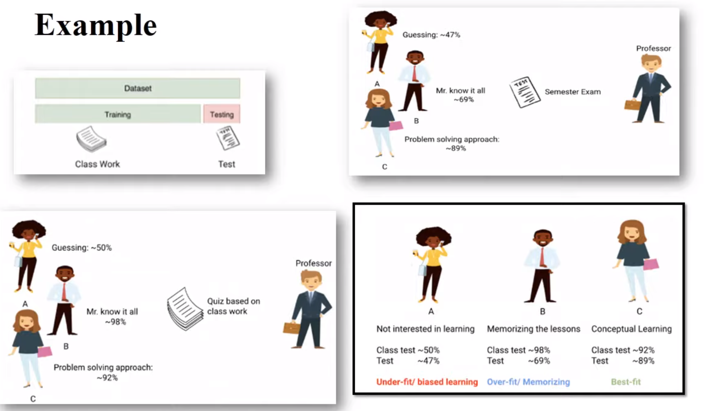
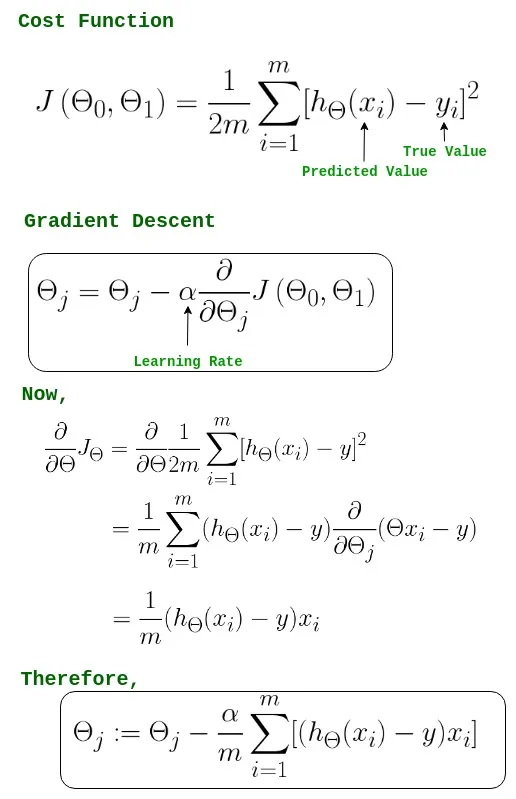

## [Mean, Median And Mode](https://www.youtube.com/watch?v=GvftKv9uctk)

## [Variance and Standard Devation](https://www.youtube.com/watch?v=1E7NU-uWalY)

## Conditional Probability

https://www.youtube.com/watch?v=evyT3_8Dnhs

https://www.youtube.com/watch?v=_IgyaD7vOOA

https://www.youtube.com/watch?v=JGeTcRfKgBo

## [Underfitting, Overfitting, bias and Varaince](https://www.youtube.com/watch?v=_cdWpxqLbI0)

## Supervised Learning 
-   Regression
    -   Simple Linear Regression
    -   Multiple Linear Regression
    -   Polynomial Linear Regression
    
-   Classification
    -   Logistic Regression
    -   Support vector Regression

## Simple Linear Regression

- :star: https://medium.com/we-are-orb/linear-regression-in-python-without-scikit-learn-50aef4b8d122

https://bagheri365.github.io/blog/Simple-Linear-Regression-from-Scratch/

https://medium.com/analytics-vidhya/everything-you-need-to-know-about-linear-regression-750a69a0ea50

https://medium.com/analytics-vidhya/understanding-the-linear-regression-808c1f6941c0

https://towardsdatascience.com/linear-regression-using-gradient-descent-97a6c8700931

    x: input data points
    y: predicted value, dependent variable (supervised learning)

    The model gets the best-fit regression line by finding the best m, c values.
    m: bias or slope of the regression line
    c: intercept, shows the point where the estimated regression line crosses the 𝑦 axis

## Multiple Linear Regression

https://faun.pub/implementing-multiple-linear-regression-from-scratch-in-python-f5d84d4935bb

https://github.com/abhilampard/Multiple-Linear-Regression-From-Scratch/blob/master/Multiple_Linear_Regression.ipynb

https://medium.com/we-are-orb/multivariate-linear-regression-in-python-without-scikit-learn-7091b1d45905

https://www.youtube.com/watch?v=sRh6w-tdtp0

