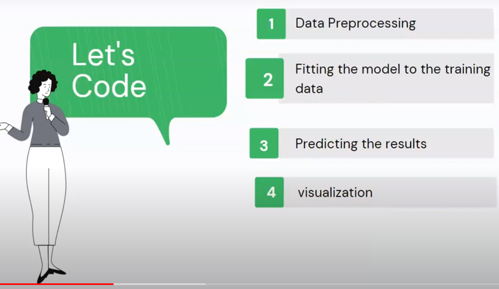

### Statistics

[Mean, Median & Mode](https://www.youtube.com/watch?v=GvftKv9uctk)

[Variance & Standard Deviation](https://www.youtube.com/watch?v=1E7NU-uWalY)

### [Difference between Simple Linear Regression & Multiple Linear Regression](https://www.youtube.com/watch?v=7zwbgtNkjNI&list=PLVG0Zju2HPJe0bhmV6l1MEE-6h0MG-20P&index=15)

Simple Linear Regression has only single independent and dependent variable.

Multiple Linear Regression has more than one independent variables and only one dependent variable.

[Difference between SLR , MLR and PR ](https://www.youtube.com/watch?v=kVVq2JDwiik) 