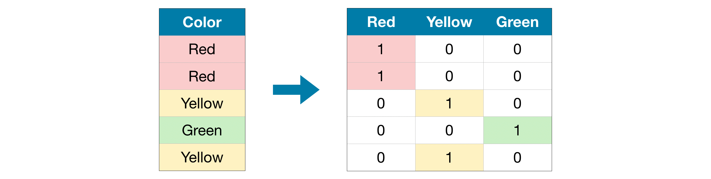
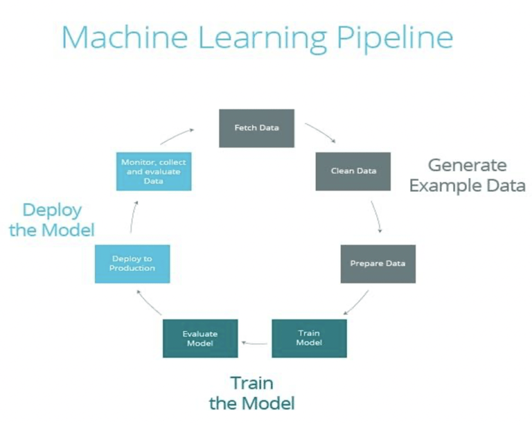

### Missing Values

1.  Imputation

    

2.  An Extension To Imputation

    

### [Categorical Variables](https://www.youtube.com/watch?v=3fc58o0ILKE)

1.  Ordinal Encoding

    

2.  One hot Encoding

    

### [Pipelines](https://www.youtube.com/watch?v=XvxptZMUo2o)

A machine learning pipeline is the end-to-end construct that orchestrates the flow of data into, and output from, a machine learning model (or set of multiple models).

### Cross-Validation

https://www.youtube.com/watch?v=xE9cIcJf48A

https://www.youtube.com/watch?v=fSytzGwwBVw

Cross-Validation is a technique which is used to train and evaluate our model on a portion of our database, before re-portioning our dataset and evaluating it on the new portions.

### [XGBoost](https://www.youtube.com/watch?v=mqxGrlv4gxI)
Extreme Gradient Boost 

-   The all in one - Algorithm
-   XGBoost is a decision-tree-based ensemble Machine Learning algorithm that uses a gradient boosting framework
-   It can be used to solve regression, classification, ranking, and user-defined prediction problems.

### [Data Leakage](https://www.youtube.com/watch?v=n9jz7G68pVg)

