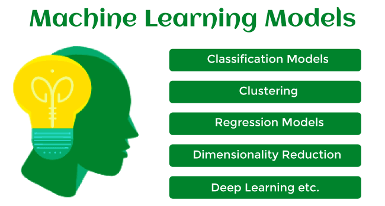

### [Decision Tree](https://www.youtube.com/watch?v=_L39rN6gz7Y)

A decision tree is a type of supervised learning algorithm that is commonly used in machine learning to model and predict outcomes based on input data. It is a tree-like structure where each internal nodetests on  attribute, each branch corresponds to attribute value and each leaf node represents the final decision or prediction.

----

### [Model]()

A machine learning model is defined as a mathematical representation of the output of the training process. Machine learning is the study of different algorithms that can improve automatically through experience & old data and build the model. A machine learning model is similar to computer software designed to recognize patterns or behaviors based on previous experience or data. The learning algorithm discovers patterns within the training data, and it outputs an ML model which captures these patterns and makes predictions on new data.

---

###  [Underfitting, Overfitting, bias and Varaince](https://www.youtube.com/watch?v=_cdWpxqLbI0)

---

### [Random Forest](https://www.youtube.com/watch?v=v6VJ2RO66Ag)

