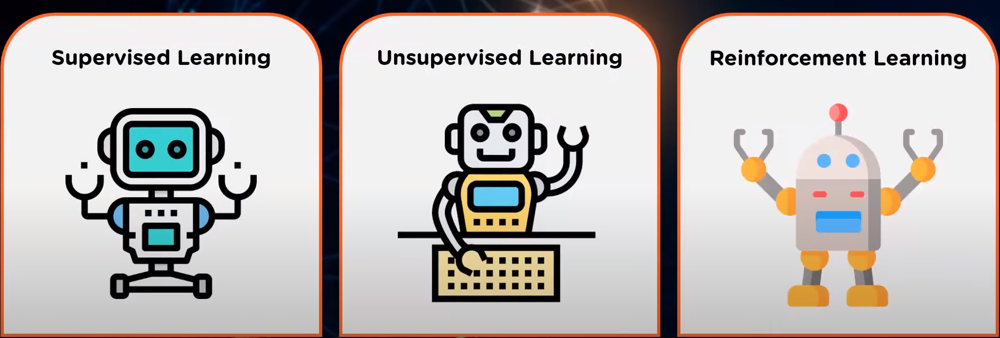
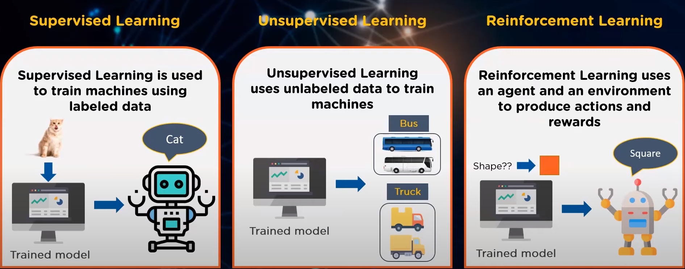
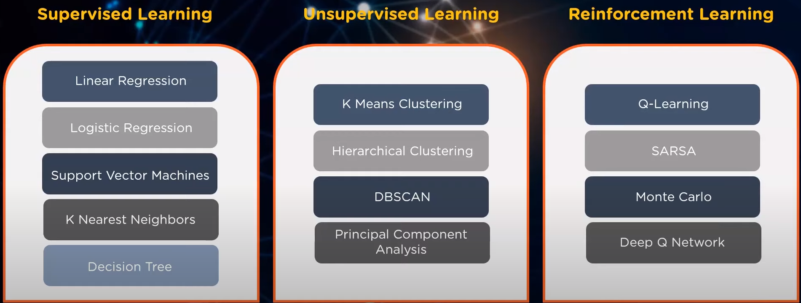
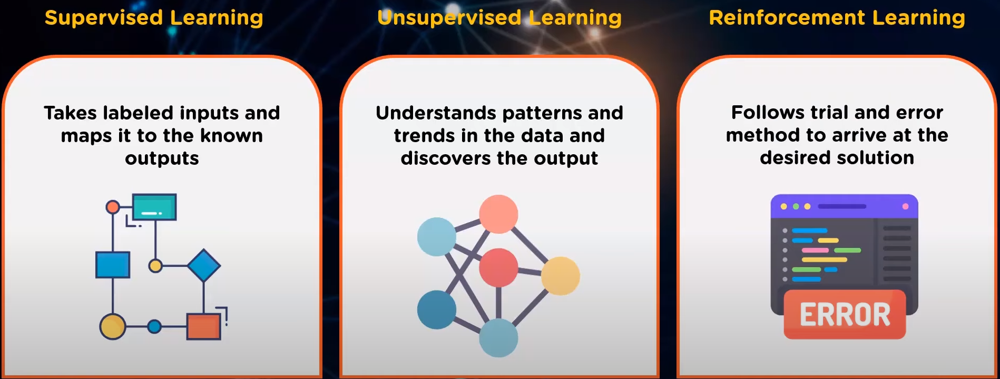
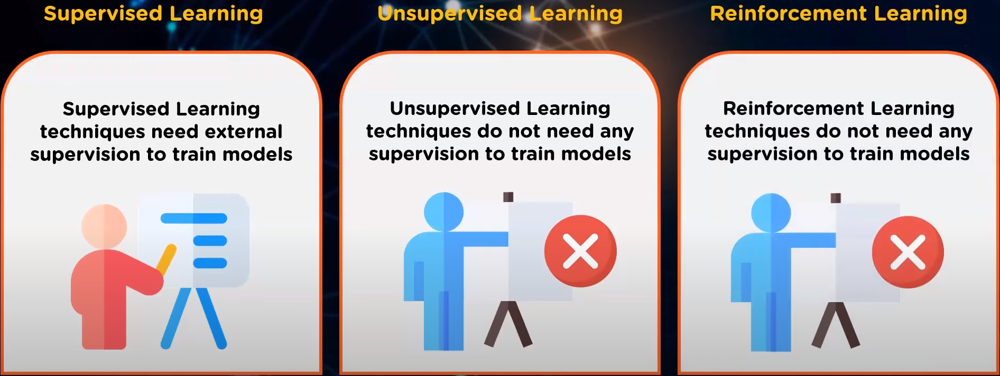
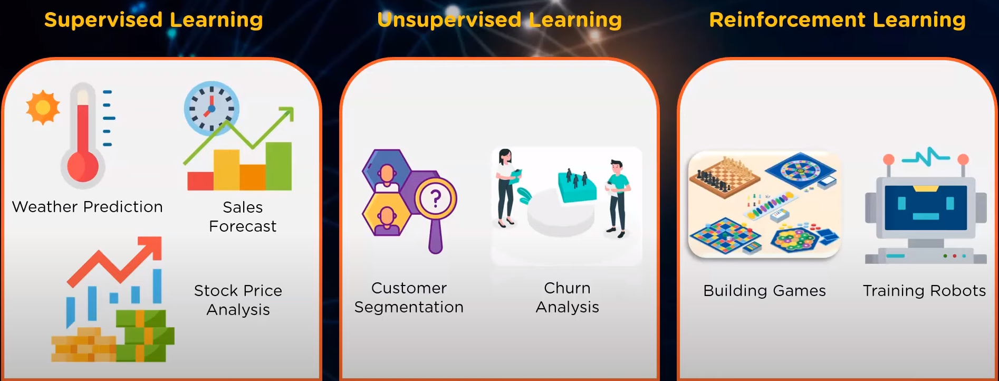

## [Machine Learning](https://www.youtube.com/watch?v=1FZ0A1QCMWc)

-   A subset of AI
-   Uses Algorithms to learn and improve from training data

**[Types in Machine Learning](https://www.youtube.com/watch?v=VAHoryyJPaA)**

**Definition**

**Algorithm**

**Approach**

**Training**

**Applications**

