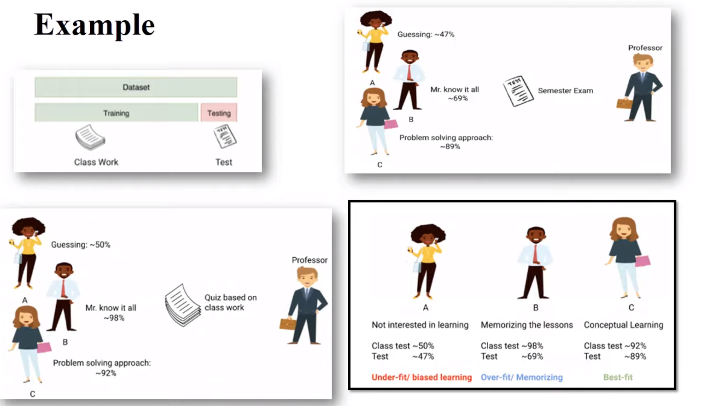

## [Mean, Median And Mode](https://www.youtube.com/watch?v=GvftKv9uctk)

-   **Mean** is average of a given set of data
-   The **median** is the middle value in a dataset when it is ordered from smallest to largest. If there is an odd number of data points, the median is the middle value. If there is an even number of data points, the median is the average of the two middle values.
-   The **mode** is the value that appears most frequently in a dataset.

## [Variance and Standard Devation](https://www.youtube.com/watch?v=1E7NU-uWalY)

**Variance** is the sum of squares of differences between all numbers and means. 
Deviation for above example. First, calculate the deviations of each data point from the mean, and square the result of each: 

variance = (9 + 1 + 1 + 1 + 0 + 0 + 4 + 16) / 8 = 4. 

Where μ is Mean, N is the total number of elements or frequency of distribution. 

  
**Standard Deviation** is square root of variance. It is a measure of the extent to which data varies from the mean. 

Standard Deviation (for above data) = &#8730;4 = 2 

## Conditional Probability

Conditional probability is a fundamental concept in probability theory that deals with the probability of an event occurring given that another event has already occurred.

-   https://www.youtube.com/watch?v=evyT3_8Dnhs
-   https://www.youtube.com/watch?v=_IgyaD7vOOA
-   https://www.youtube.com/watch?v=JGeTcRfKgBo

### [Underfitting, Overfitting, bias and Varaince](https://www.youtube.com/watch?v=_cdWpxqLbI0)

