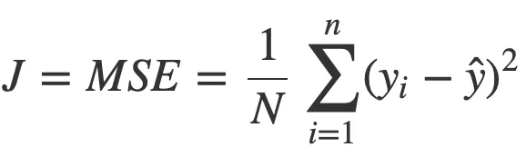
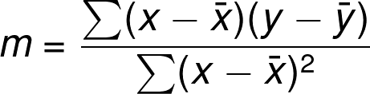
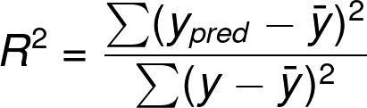

## [Mean, Median And Mode](https://www.youtube.com/watch?v=GvftKv9uctk)

## [Variance and Standard Devation](https://www.youtube.com/watch?v=1E7NU-uWalY)

## Conditional Probability

https://www.youtube.com/watch?v=evyT3_8Dnhs

https://www.youtube.com/watch?v=_IgyaD7vOOA

https://www.youtube.com/watch?v=JGeTcRfKgBo

## [Underfitting, Overfitting, bias and Varaince](https://www.youtube.com/watch?v=_cdWpxqLbI0)

## Simple Linear Regression

https://medium.com/geekculture/linear-regression-from-scratch-in-python-without-scikit-learn-a06efe5dedb6

https://betterprogramming.pub/simple-linear-regression-using-only-python-5c86af200bca

    x: input data points
    y: predicted value, dependent variable (supervised learning)

    The model gets the best-fit regression line by finding the best m, c values.
    m: bias or slope of the regression line
    c: intercept, shows the point where the estimated regression line crosses the 𝑦 axis

**Mean Squared Error (MSE)-**

**Using this formula to find the m value**

**R-squared value:**

## Multiple Linear Regression

https://faun.pub/implementing-multiple-linear-regression-from-scratch-in-python-f5d84d4935bb
